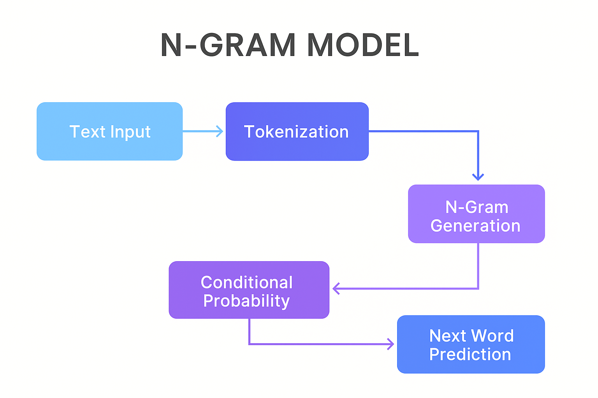

# N-Gram Language Model – Next Word Prediction  
A simple and beginner-friendly implementation of an **N-Gram Based Next-Word Prediction Model** built using Python.  
This project uses statistical NLP methods (no deep learning) to predict the next word based on previous context.

---

## 📌 Features
- Tokenization & preprocessing  
- Unigram, Bigram, Trigram generation  
- Probability & smoothing  
- Next-word prediction  
- Works on any custom text dataset  
- Clean & easy-to-understand code  

---

## 📂 Project Structure

	Ngram-Model/
		│── flowchart.png
		│── ngram-language-model.py
		│── training_sentences.txt

---

## 🧠 How the Model Works (Simple Explanation)

1. **Text Cleaning**  
   Input text is converted to lowercase and split into tokens.

2. **Create N-Grams**  
   Model generates:
   - 1-grams (single word)
   - 2-grams (pairs)
   - 3-grams (triplets)

3. **Count Frequencies**  
   - Each n-gram is counted to build probability tables.

4. **Predict Next Word**  
   - For a given context sentence, the model finds the most probable next word.

---

## 🔄 Project Flowchart

   - Below is the visual flow of how the prediction system works:



---

## 📜 Code Overview

### 🔧 Training the Model
```python
lm = NgramLM(n=3, alpha=0.5)
lm.fit(corpus)
ctx = tokenize("The weather changed")
lm.predict_next(ctx, top_k=3)
```
## 📤 Example Output

==================== N-GRAM NEXT WORD PREDICTION ====================

🔹 Input Context:
   ['the', 'weather', 'changed']

🔹 Top 3 Predicted Suggestions:
   1. suddenly     | Probability: 0.1842
   2. today        | Probability: 0.1219
   3. after        | Probability: 0.0973

====================================================================

## 📊 Dataset

### The model uses a small training dataset stored in:
   - training_sentences.txt

## 🛠️ Technologies Used

   -  Python
   - 
   -  Regex
   - 
   -  Collections (Counter, defaultdict)
   - 
   -  Math (log & exp for probability)

## 🚀 How to Run

### Clone the repo

   #### git clone https://github.com/Golu09846/ngram-language-model/blob/main/ngram-language-model.py


### Navigate to folder

   - cd Ngram-Model


### Run the model

   - python ngram-language-model.py

## 🙌 Author

### Abdullah
### Data Science Intern @ AnalyticShala
### Trainer: Faizan Ansari

## ⭐ Contribute

### Pull requests and improvements are welcome!
## 📄 License

### This project is open-source under the MIT License.
